# 🛒 MERN Stack E-Commerce Website

A full-stack **E-Commerce Web Application** built using the **MERN
Stack** with separate features for **Users and Admin**.

but we will expore frontend part here <br>
backend part github link:  [backend-app](https://github.com/sachinwebdev369/backend-app)

The application provides a complete online shopping experience where
users can register, browse products, search and filter products, manage
their cart, place orders, and view their order history. The admin panel can manage products, users, orders, and view
dashboard statistics.


# 📸 Screenshots

## 🏠 Home Page

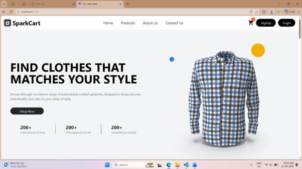

## 🛍️ Products Page

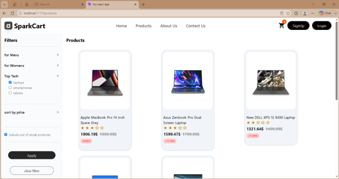


## 🛒 Cart Page

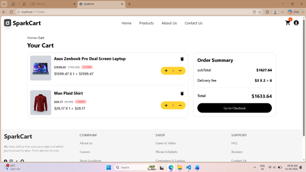

## 💳 Checkout Page (shipping)

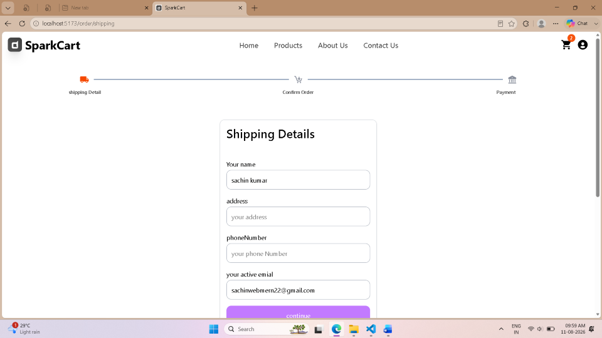

## 💳 Checkout Page (confirm order)

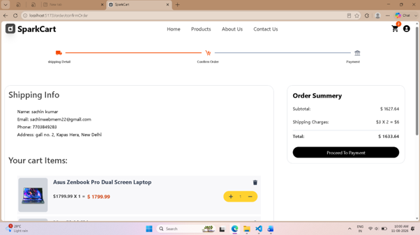

## 💳 Checkout Page (payment)

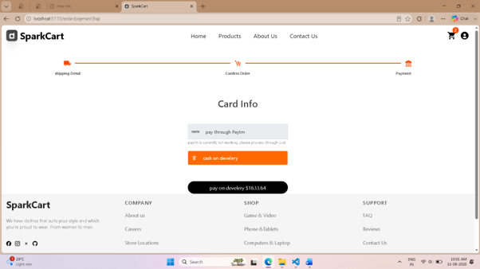

## 👤 User Dashboard (profile)

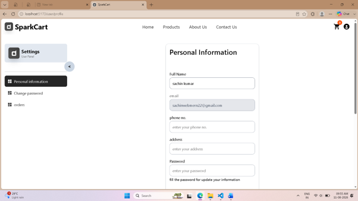

## 👤 User Dashboard (change password)

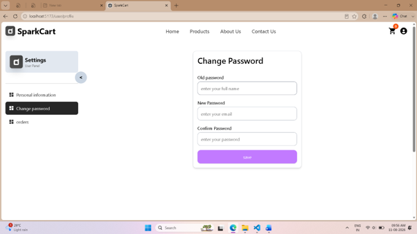

## 👤 User Dashboard (orders)

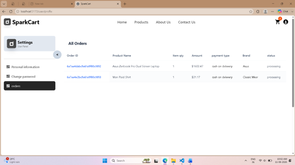

## 🔐 Login Page

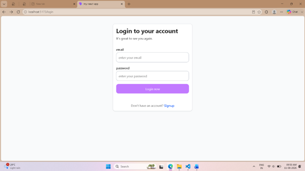

## 📝 Register Page

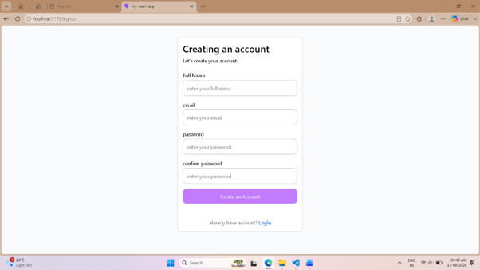

## 🛠️ Admin Dashboard

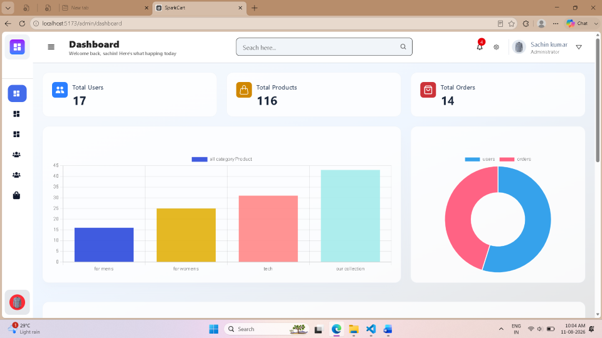

## 📦 Admin Product Management

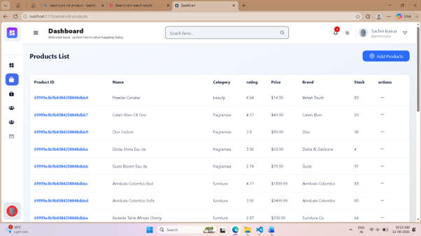

## 👥 Admin User Management

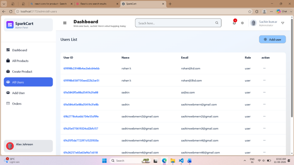

## 🚚 Admin Order Management

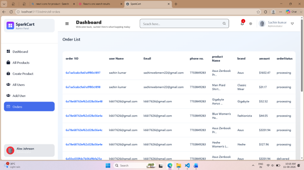


## 📌 Project Overview

This project is a complete e-commerce platform with two main sections:

-   👤 **User Panel**
-   🛠️ **Admin Panel**

The frontend is developed using **React.js**, while the backend uses
**Node.js and Express.js**. **MongoDB** is used as the database.

## ✨ Features

### 👤 User Features

-   User Registration
-   User Login / Logout
-   Secure Authentication
-   Home Page
-   Product Listing
-   Product Filtering
-   Product Sorting
-   Product Details
-   Add Product to Cart
-   Remove Product from Cart
-   Increase Product Quantity
-   Decrease Product Quantity
-   Cart Total Calculation
-   Three-Step Checkout
    1.  Add Delivery Address
    2.  Confirm Order and Price
    3.  Select Payment Method / Cash on Delivery
-   Order Placement
-   Order History
-   User Dashboard
-   Profile Management
-   About Us Page
-   Contact Us Page
-   Responsive User Interface

### 🛠️ Admin Features

-   Admin Login
-   Admin Dashboard
-   Dashboard Statistics
-   Add Product
-   Edit Product
-   Update Product
-   Delete Product
-   Product Image Upload
-   Product Management
-   User Management
-   Edit Users
-   Delete Users
-   Order Management
-   View Orders
-   Update Order Status
-   View Reports

## 🏗️ Technology Stack

### Frontend

-   React.js
-   React Router DOM
-   Redux Toolkit
-   React Redux
-   Axios
-   Tailwind CSS
-   React Hook Form
-   React Icons
-   Chart.js
-   React Chart.js 2

### Backend

-   Node.js
-   Express.js
-   Mongoose
-   JSON Web Token (JWT)
-   bcryptjs
-   CORS
-   Cookie-parser
-   Crypto

### Database

-   MongoDB

### Tools

-   Visual Studio Code
-   Git
-   GitHub
-   Postman
-   MongoDB Compass

## 📂 Project Structure

``` text
e-commerce/
│
├── frontend/
│   ├── public/
│   └── src/
│       ├── components/
│       ├── pages/
│       ├── store/
│       ├── protectedRoutes/
│       ├── assets/
│       ├── App.jsx
│       └── main.jsx
│       └── README.md
├── backend/
    ├── config/
    ├── controllers/
    ├── middleware/
    ├── models/
    ├── routes/
    ├── utils/
    ├── app.js
    └── server.js
    └── README.md

```


## 🔐 Security

The project includes:

-   Password hashing using **bcryptjs**
-   JWT-based authentication
-   Protected routes
-   Admin authorization
-   Cookie-based authentication where implemented
-   CORS configuration
-   Input validation
-   Secure API access

## ⚙️ Installation and Setup

### 1. Clone the Repository

``` bash
git clone https://github.com/sachinwebdev369/frontend-app.git
cd frontend-app
```


### 2. Frontend Setup

Open a new terminal:

``` bash
cd frontend
npm install
npm run dev
```


## ⭐ Support

If you find this project useful, consider giving the repository a ⭐ on
GitHub.
